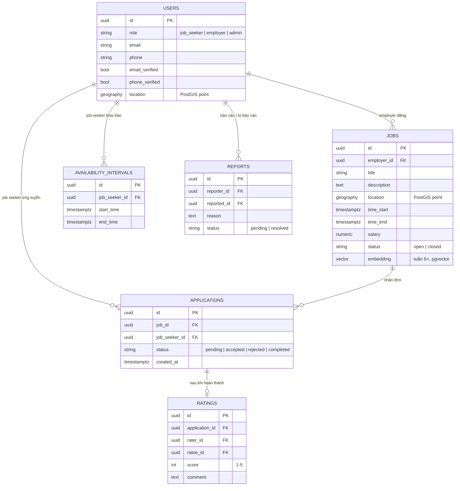

# ERD

> Nguồn entity: `.claude/docs/database.md`. `ratings`/`reports` chỉ cần từ tuần 6+ nhưng vẽ sẵn để ERD không phải sửa lại giữa chừng.

## Ghi chú
- `AVAILABILITY_INTERVALS.start_time/end_time` là datetime thực, **không phải enum ca cố định** — đây là điểm khác biệt cốt lõi của đề tài (xem `.claude/docs/database.md`).
- `JOBS.embedding` chỉ dùng từ tuần 6+ khi nâng cấp semantic_score sang embedding; tuần 1-5 semantic tính runtime bằng TF-IDF, không lưu vector.
- `RATINGS` là 1 dòng cho 1 chiều đánh giá (rater→ratee); rating 2 chiều của 1 application = 2 row.
