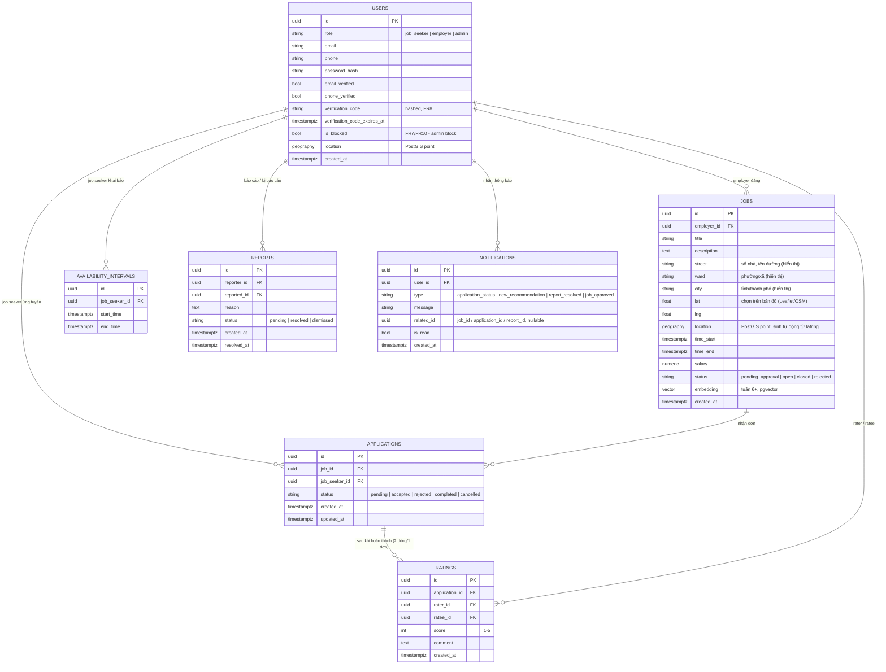

# ERD

> Nguồn entity: `.claude/docs/database.md`. Vẽ đủ 7 entity (kể cả các entity chỉ cần từ tuần 6+) để ERD không phải sửa lại giữa chừng dự án — map đúng 1:1 với FR1-FR10 (`docs/PROJECT_PLAN.md` mục 3.1).

## Ghi chú
- `AVAILABILITY_INTERVALS.start_time/end_time` là datetime thực, **không phải enum ca cố định** — đây là điểm khác biệt cốt lõi của đề tài (xem `.claude/docs/database.md`).
- `JOBS.embedding` chỉ dùng từ tuần 6+ khi nâng cấp semantic_score sang embedding; tuần 1-5 semantic tính runtime bằng TF-IDF, không lưu vector.
- `JOBS.status = pending_approval` là trạng thái khởi tạo nếu Admin phải duyệt tin trước khi hiển thị công khai (FR10/UC12); nếu tuần 1-5 chưa làm kịp UC12, mặc định `status = open` ngay khi đăng — không block luồng chính.
- `RATINGS` là 1 dòng cho 1 chiều đánh giá (rater→ratee); rating 2 chiều của 1 application = 2 row.
- `USERS.verification_code` dùng chung cho cả xác minh email lẫn SĐT (2 lần gọi, không cần 2 cột riêng) — mã hết hạn (`verification_code_expires_at`) thì sinh mã mới đè lên, không cần bảng OTP riêng.
- `NOTIFICATIONS.related_id` trỏ tới entity liên quan tùy `type` (job/application/report) — không dùng FK cứng vì tham chiếu đa bảng, validate ở tầng application.
