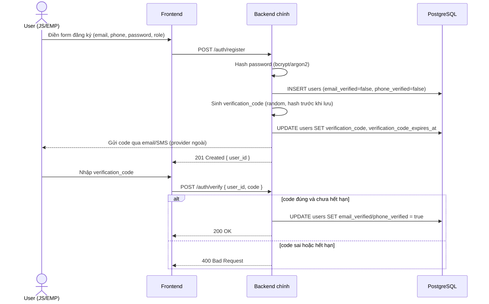
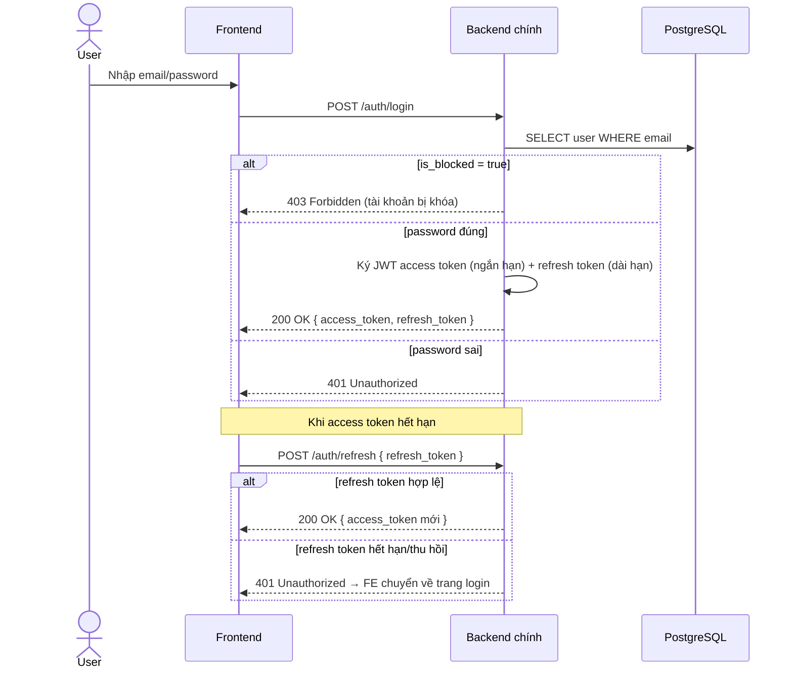
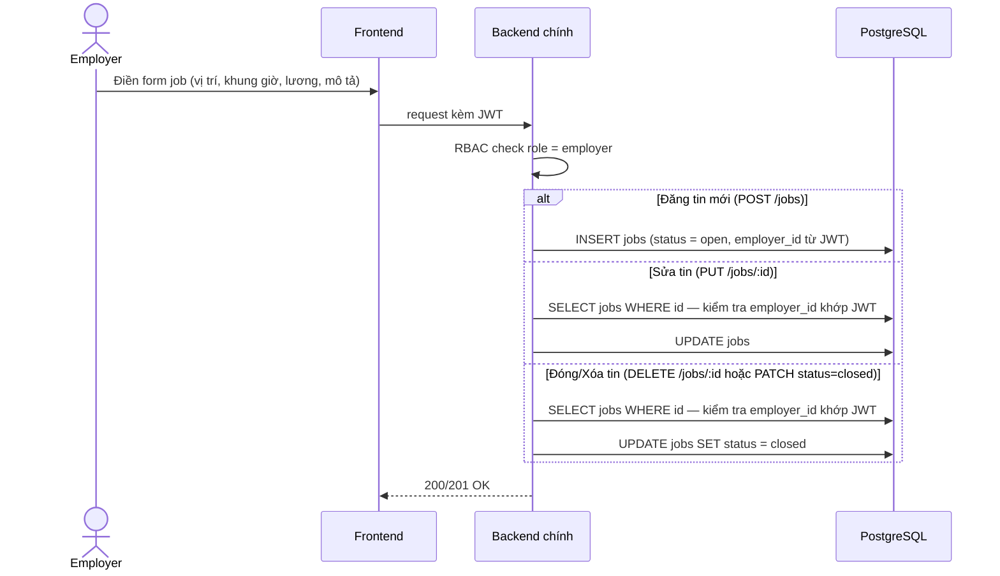
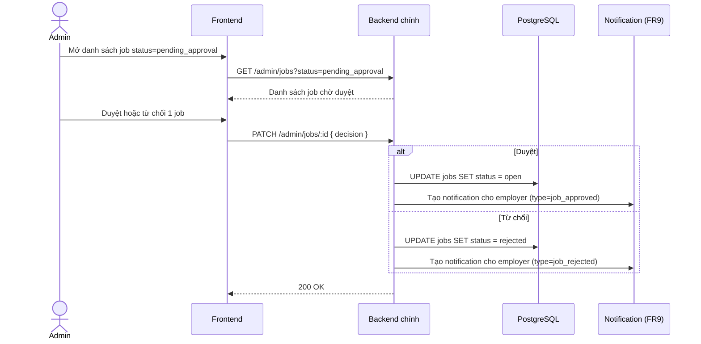
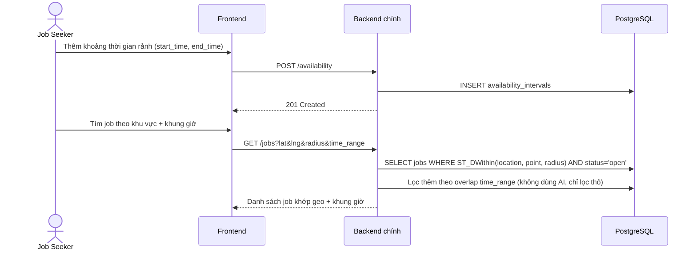
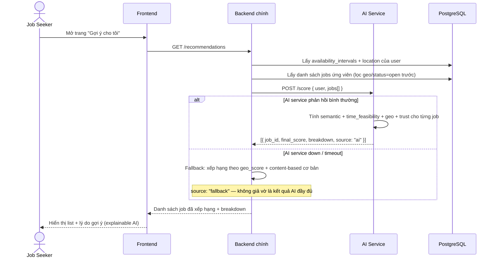
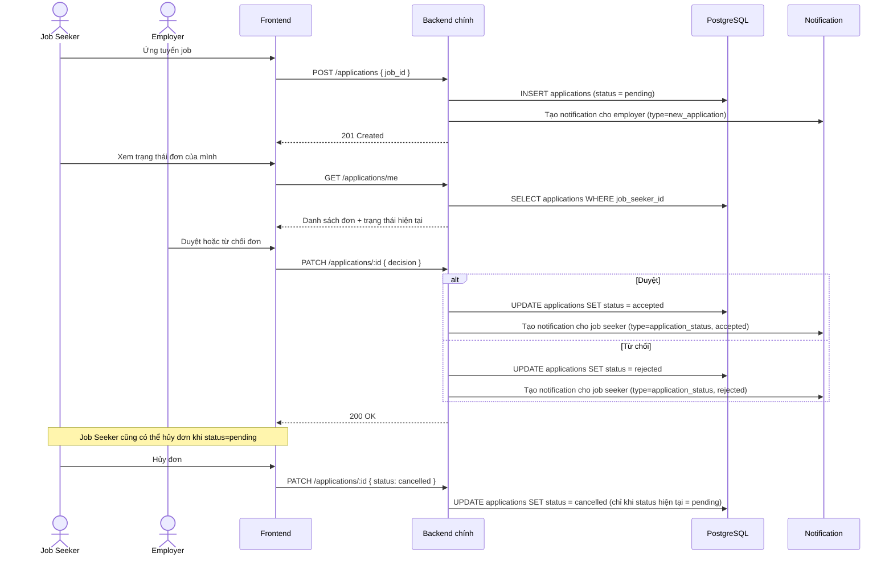
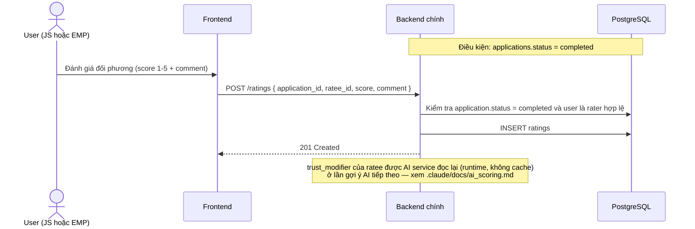
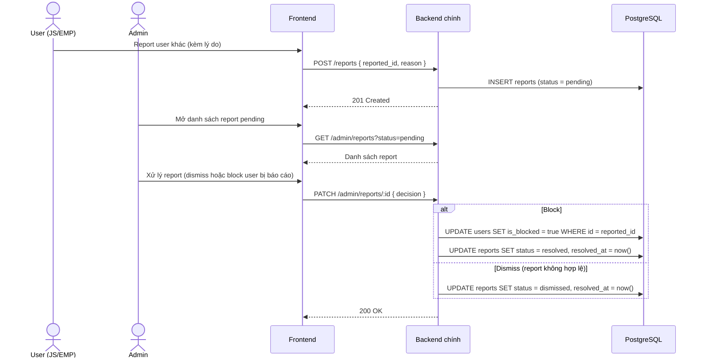
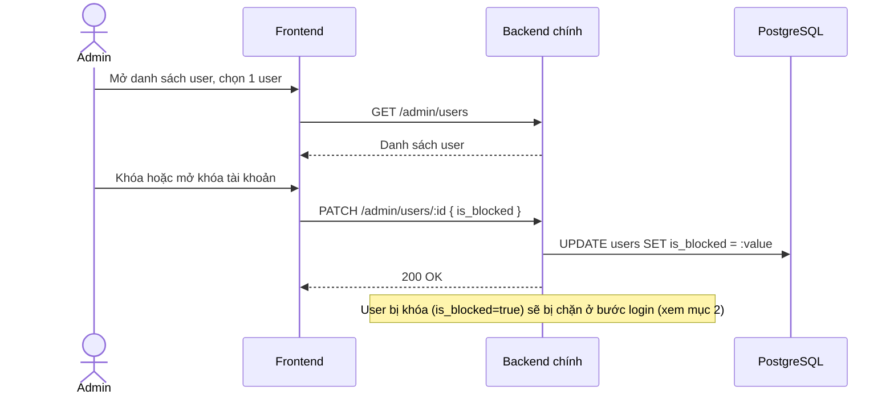

# Sequence Diagrams — Toàn bộ luồng chính

> Mỗi section ứng với 1 FR (`docs/PROJECT_PLAN.md` mục 3.1). Nguồn contract Backend↔AI Service: `.claude/docs/architecture.md`. Các thao tác CRUD đối xứng (sửa/xóa job) gộp chung 1 diagram bằng nhánh `alt` thay vì vẽ lặp lại — nội dung vẫn đủ, không bớt luồng nào.

## 1. Đăng ký + Xác minh Email/SĐT (FR1, FR8)

**Ghi chú:** nếu tuần 1-5 không kịp tích hợp provider gửi email/SMS thật, đăng ký cho phép hoạt động với `email_verified=false` (không chặn đăng nhập) — hoàn thiện bước gửi/xác minh thật ở tuần 6+ (xem `docs/design/use-case.md` ghi chú UC3).

---

## 2. Đăng nhập + Refresh Token (FR1)

---

## 3. Employer: Đăng / Sửa / Đóng tin tuyển dụng (FR2)

**Ghi chú:** kiểm tra `employer_id` khớp JWT là bắt buộc ở mọi nhánh sửa/đóng — RBAC role-level không đủ, còn cần ownership check để employer A không sửa được job của employer B.

---

## 4. Admin: Duyệt tin đăng (FR10)

**Ghi chú:** nếu tuần 1-5 chưa cài UC19, job mặc định `status=open` ngay khi đăng (bỏ bước duyệt) — không chặn luồng chính; bật lại bước duyệt này khi làm FR10 ở tuần 6+.

---

## 5. Job Seeker: Khai báo lịch rảnh + Tìm/lọc job (FR3)

**Ghi chú:** đây là tìm/lọc **thô** (geo + time filter trực tiếp bằng SQL/PostGIS), khác với luồng gợi ý AI ở mục 6 — user có thể dùng UC5 độc lập mà không cần AI service chạy.

---

## 6. Gợi ý AI (FR4)

---

## 7. Ứng tuyển → Duyệt/Từ chối → Thông báo (FR5, FR9)

---

## 8. Đánh giá hai chiều sau khi hoàn thành (FR6)

---

## 9. Report / Block user → Admin xử lý (FR7)

---

## 10. Admin: Khóa / Mở khóa tài khoản user (FR10)

## Ghi chú chung
- Tất cả sequence diagram trên map đúng 1:1 với FR1-FR10 — không có FR nào thiếu luồng minh họa.
- 10 diagram này là **thiết kế mức API/luồng dữ liệu**, chưa phải đặc tả endpoint chi tiết — OpenAPI spec thật sinh tự động từ FastAPI khi code (`/docs`), không cần viết tay riêng.
