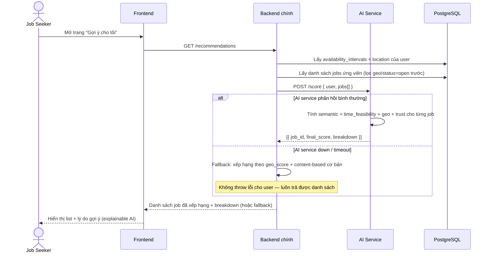

# Sequence Diagram — Luồng gợi ý AI (luồng trung tâm)

> Nguồn contract: `.claude/docs/architecture.md`. Đây là luồng quan trọng nhất để chứng minh giá trị đề tài, nên chọn vẽ chi tiết thay vì tất cả luồng CRUD (đăng ký, đăng tin... là CRUD chuẩn, không cần sequence diagram riêng).

## Ghi chú
- Breakdown luôn phải có trong response — kể cả nhánh fallback (breakdown khi đó chỉ có geo, không có semantic/time/trust, và cần đánh dấu rõ `source: fallback` để FE hiển thị đúng, không giả vờ là kết quả AI đầy đủ).
- Luồng này ứng với FR4 (`docs/PROJECT_PLAN.md` mục 3.1), bắt buộc chạy được bằng TF-IDF ở mốc tuần 5.
