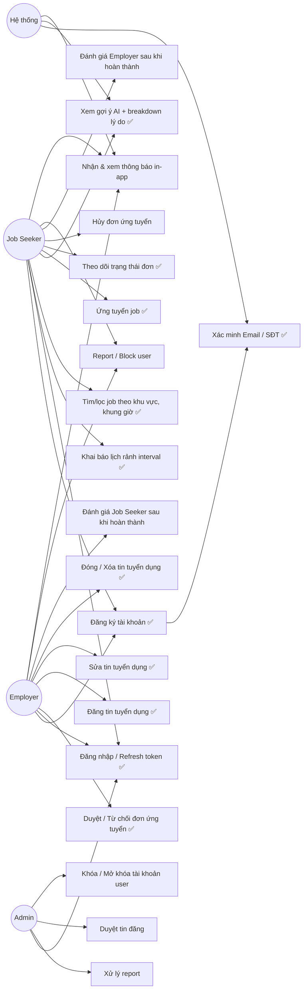

# Use Case Diagram

> ✅ = bắt buộc cuối tuần 5 (mốc 70%, theo `docs/PROJECT_PLAN.md` mục 3.1). Không nhãn = tuần 6-12. Map đầy đủ FR1-FR10, không rút gọn.

## Danh sách use case theo FR

| UC | Tên | FR | Actor | Phase |
|---|---|---|---|---|
| UC1 | Đăng ký tài khoản | FR1 | JS, EMP | ✅ Tuần 1-5 |
| UC2 | Đăng nhập / Refresh token | FR1 | JS, EMP, ADM | ✅ Tuần 1-5 |
| UC3 | Xác minh Email / SĐT | FR8 | JS, EMP, Hệ thống | ✅ Tuần 1-5 (làm sớm cùng auth) |
| UC4 | Khai báo lịch rảnh interval | FR3 | JS | ✅ Tuần 1-5 |
| UC5 | Tìm/lọc job theo khu vực, khung giờ | FR3 | JS | ✅ Tuần 1-5 |
| UC6 | Xem gợi ý AI + breakdown | FR4 | JS, Hệ thống | ✅ Tuần 1-5 |
| UC7 | Ứng tuyển job | FR5 | JS | ✅ Tuần 1-5 |
| UC8 | Theo dõi trạng thái đơn | FR5 | JS | ✅ Tuần 1-5 |
| UC9 | Hủy đơn ứng tuyển | FR5 (mở rộng) | JS | Tuần 6-12 |
| UC10 | Duyệt / Từ chối đơn ứng tuyển | FR5 | EMP | ✅ Tuần 1-5 |
| UC11 | Đăng tin tuyển dụng | FR2 | EMP | ✅ Tuần 1-5 |
| UC12 | Sửa tin tuyển dụng | FR2 | EMP | ✅ Tuần 1-5 |
| UC13 | Đóng / Xóa tin tuyển dụng | FR2 | EMP | ✅ Tuần 1-5 |
| UC14 | Đánh giá Employer | FR6 | JS | Tuần 6-12 |
| UC15 | Đánh giá Job Seeker | FR6 | EMP | Tuần 6-12 |
| UC16 | Report / Block user | FR7 | JS, EMP | Tuần 6-12 |
| UC17 | Xử lý report | FR7 | ADM | Tuần 6-12 |
| UC18 | Nhận & xem thông báo in-app | FR9 | JS, EMP, Hệ thống | Tuần 6-12 |
| UC19 | Duyệt tin đăng | FR10 | ADM | Tuần 6-12 |
| UC20 | Khóa / Mở khóa tài khoản user | FR10 | ADM | Tuần 6-12 |

## Ghi chú
- Actor **Hệ thống** đại diện cho các use case do backend tự kích hoạt (gửi mã xác minh, tính lại gợi ý khi có job mới, sinh thông báo) — không phải người dùng chủ động gọi, nhưng vẫn là một luồng nghiệp vụ cần cài đặt.
- `UC3` (xác minh) đặt ✅ ở tuần 1-5 dù FR8 gắn nhãn "Tuần 6-12" trong bảng FR gốc, vì về mặt kỹ thuật nó nằm chung luồng đăng ký (UC1) — tách ra làm sau sẽ phải sửa lại schema `users` đã có. Quyết định cuối cùng vẫn theo `docs/PROJECT_PLAN.md` mục 3.1; nếu tuần 1-5 không kịp, làm luồng đăng ký **bỏ qua bước xác minh bắt buộc** (auto `email_verified/phone_verified = false`, không chặn đăng nhập) rồi hoàn thiện UC3 thật ở tuần 6+.
- `UC9` (hủy đơn) và `UC20` (khóa/mở khóa) không có trong bảng FR gốc nhưng là phần bù bắt buộc để UC8/UC10 và UC17 hoạt động trọn vẹn (theo dõi đơn phải có đường hủy; xử lý report phải có hành động cụ thể) — không phải tính năng mới ngoài scope, chỉ là chi tiết hóa FR5/FR10 đã có.
