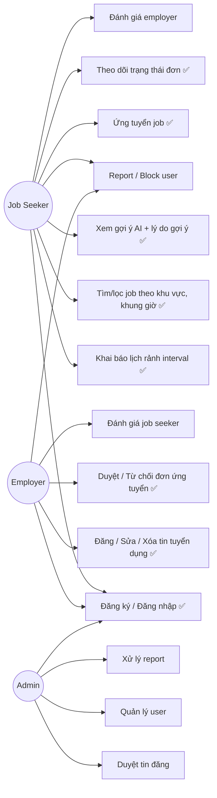

# Use Case Diagram

> ✅ = bắt buộc cuối tuần 5 (mốc 70%, theo `docs/PROJECT_PLAN.md` mục 3.1). Còn lại = tuần 6-12.

## Ghi chú
- `UC1` (đăng ký/đăng nhập) dùng chung 3 role, phân quyền qua RBAC backend (`.claude/docs/security.md`).
- `UC4` (xem gợi ý AI) là use case trung tâm của đề tài — bắt buộc có breakdown điểm, không chỉ danh sách xếp hạng.
- Các use case không có nhãn ✅ (rating, report/block, admin) nằm trong `docs/PROJECT_PLAN.md` mục 2.2 — hoàn thiện tuần 6-12.
